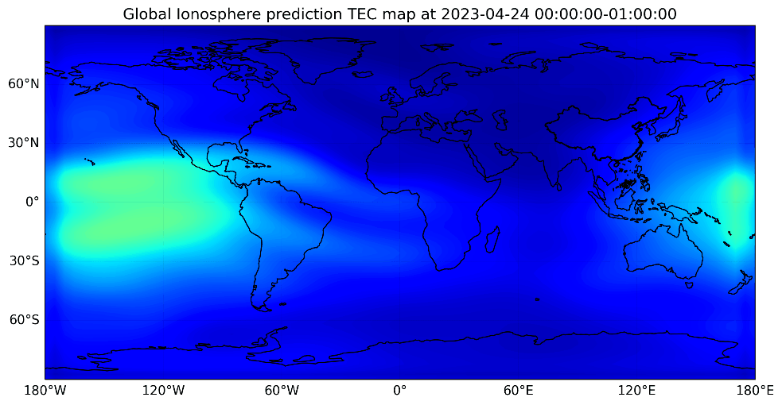
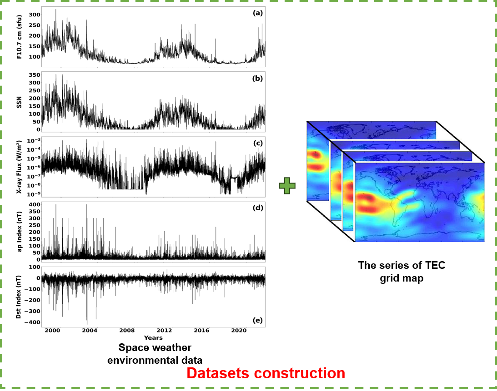

## Intro
We applied a prediction model based on self-attention memory ConvLSTM (SAM-ConvLSTM) to predict the global ionospheric total electron content (TEC) maps with up to 1 day of lead time.  
  

*<center>(Demo) Prediction Example at 2023-04-24 00:00:00 - 23:00:00</center>*  


## Environment
```
Cartopy==0.20.2
cnmaps==1.1.1
gnsspy.egg==info
matplotlib==3.5.2
netCDF4==1.6.5
numpy==1.23.5
pandas==2.1.2
Pillow==9.1.1
Pillow==10.1.0
tensorflow==2.10.0
```
With the corresponding libraries and version requirements in./code/requirements.txt, run the following cmd command to install all the dependent libraries at once:
```
pip install -r requirements.txt
```


## Training data preprocessing
The total training data includes the F10.7 index, SSN index, X-ray radiation flux, ap index, Dst index and Ionosphere TEC maps. The dataset is shown as follows:    

*<center> The total dataset </center>*  
* The F10.7 index, SSN index, ap index, Dst index can be downloaded from https://cdaweb.gsfc.nasa.gov/.  
* The X-ray radiation flux can be downloaded from https://data.ngdc.noaa.gov/platforms/solar-space-observing-satellites/.  
* The Ionosphere TEC maps can be downloaded from http://ftp.aiub.unibe.ch/CODE/.  
  
Due to defects and outliers in the original downloaded feature data, it needs to be preprocessed in advance. In addition, for different types of features, their time sampling frequency is not the same. In the data set we made, the time sampling rate of all data was unified to 1 hour. The function code for the above operations is stored in ***preprocess.py*** under the code directory.  
***preprocess.py*** mainly contains the following processing functions: *process_F10_7_SSN_Dst_ap()*, *process_X_ray()*, *process_X_ray_nc()*, *process_TEC_global_to_list()*, their purpose and usage are as follows:

* *process_F10_7_SSN_Dst_ap()*: This function is used to process outliers and defects of the downloaded csv file containing F10_7 index, SSN index, Dst index, and ap index. After that, the time frequency of each feature is unified to 1 hour operation. Finally, a new csv file containing the F10_7 index, SSN index, Dst index, and ap index is generated. Specific usage examples are listed as follows:  
```python
csvpath="./F10_7_SSN_Dst_ap.csv"
outpath="./processed_F10_7_SSN_Dst_ap.csv"
process_F10_7_SSN_Dst_ap(csvpath,outpath)
```

* *process_X_ray()*: Since X-ray data downloaded from the Internet was in csv format before 2017, it has changed to nc file format since 2017. Therefore, two processing functions for X-ray data are written in the code, the function for csv format is process_X_ray(), and the function for nc format is process_X_ray_nc(). Both functions generate a pre-processed csv file containing the X-ray data, and the final X-ray data set from 1999 to 2022 is a concatenation of two csv files. Specific usage examples are listed as follows:  
```python
csvpath="./X_ray_1999_2017.csv"
outpath="./processed_X_ray_1999_2017.csv"
process_X_ray(csvpath,outpath)
```

* *process_X_ray_nc()*: Specific usage examples are listed as follows:  
```python
path='.\\2017-2022'
outpath='D:\\processed_X_ray_2017_2022.csv'
process_X_ray_nc(path,outpath)
```

* *process_TEC_global_to_list()*: This function processes all the ionospheric grid products (.i files) provided by the CODE organization from 1999 to 2022 into an npy data file. Specific usage examples are listed as follows:  
```python
process_TEC_global_to_list('D:\\TEC\\ion')
```

Then, the processed_F10_7_SSN_Dst_ap.csv and processed_X_ray_1999_2017.csv obtained above are integrated into a csv file. The data set is named 1999_2022_f107_ssn_xray_ap_dst.csv. (The data set has been placed in the current project warehouse, but because github restricts the uploading of large-capacity data sets, there is no TEC data set in the warehouse at present. If necessary, please contact our email address to obtain TEC data set: lhz1018474820@163.com). At this point, the data set needed for our training is complete.


   
## Model training
The specific model training program is placed in ***model_train.py***. The corresponding hyperparameters (such as iteration epoches, batch_size, learning rate, etc.) can be modified in the corresponding part of the code.  
Operation mode(cmd window):  
```
python model_train.py
```
Finally, the corresponding model weight file is generated!


## Model evaluate
We mainly used Mean Absolute Error (MAE), Root Mean Squared Error (RMSE) and Correlation Coefficient (CC) to evaluate the prediction performance of the model. The specific code is placed in ***model_evaluation.py***. If you need to evaluate the predicted performance of the original data set on a certain day, then you need to index the data sets of the previous two days in the program in advance as the input to the model, prepare the corresponding TEC truth values (we provide TimeSeries() function to partition the data set), and then run the program to evaluate the performance. However, if the date to be predicted is not in the original produced data set, then you need to prepare the new data set in advance and evaluate it as described in the "Training data preprocessing" section.  
Operation mode(cmd window):  
```
python model_evaluation.py
```


